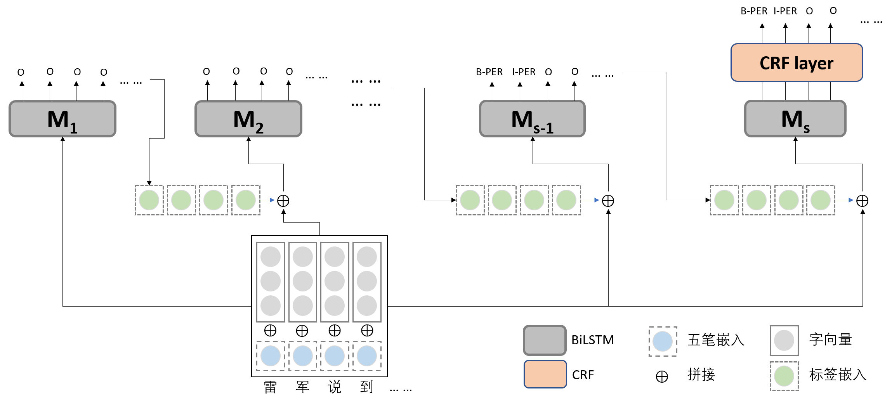

## Utilizing Glyph Feature and Iterative Learning for Named Entity Recognition in Financial Field 

code for paper "Utilizing Glyph Feature and Iterative Learning for Named Entity Recognition in Financial Field"(Chinese name: 结合字形特征与迭代学习的金融领域命名实体识别) in CCL 2019.

Due to the project contract, we cannot release our dataset. We put some sample in the data directory.


### dependency

- pytorch >= 0.4.0

- python3


### model architecture




### how to run

1. we use pretrained Chinese word embedding from [this link](https://github.com/Embedding/Chinese-Word-Vectors), you should download it and put it into ./pretrain\_embedding.
2. run the script:

```shell
python ./train_eval_BCCWL.py --dataset finance \
	--wubi_mode CNN \
	--aux_num 3 \
```

